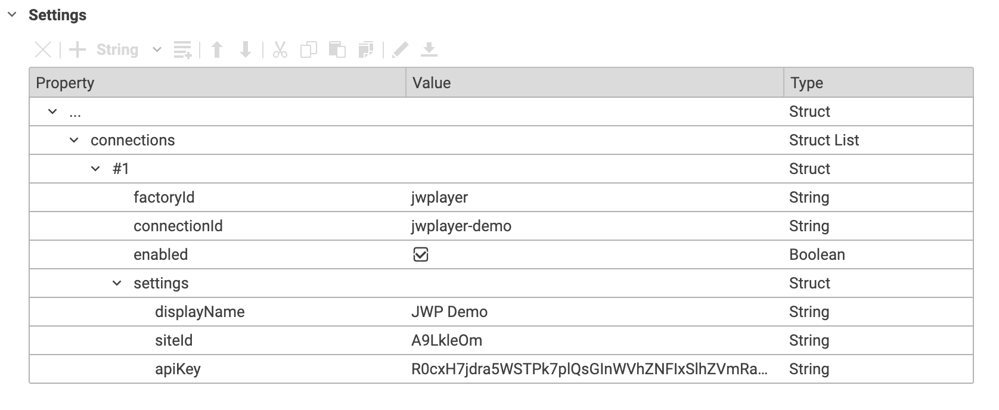

# Content Hub Adapter for JW Player

This CoreMedia Content Hub Adapter allows to integrate [JW Player](https://www.jwplayer.com/) into CoreMedia Studio Library.

The adapter can be used to browse the JW Player media library and playlists and allows to import media references into CoreMedia Content Cloud.

## Adapter Configuration
After adding the adapter plugin to your CoreMedia Content Cloud installation, you need to configure the adapter via settings in CoreMedia Studio. Please find an example configuration below.

Settings path: `/Settings/Options/Settings/Content Hub/Connections/JW Player`

Configure the following for each connection.

| Key                  | Value                | Description                                                                                                                   |
|----------------------|----------------------|-------------------------------------------------------------------------------------------------------------------------------|
| factoryId            | `jwplayer`           | Factory id used for the connection. Needs to be `jwplayer`                                                                    |
| connectionId         | `YOUR CONNECTION ID` | Your connection id e.g. `jwplayer-1`, `jwplayer-2`, etc.                                                                      | 
| enabled              | `true&#124;false`    | Enables or disables the connection                                                                                            |
| settings             |                      | Struct with settings (see next rows)                                                                                          |
| settings.displayName | My JW Player Account | Custom Display Name shown in the Studio library for this connection                                                           |
| settings.siteId      | `YOUR SITE ID`       | See [JWP API Refernce > Site ID](https://docs.jwplayer.com/platform/reference/building-a-request#site-id) to get your site id | 
| settings.apiKey      | `YOUR API KEY`       | Can be created on the [JWP Dashboard > Account > API Credentials](https://dashboard.jwplayer.com/account/api-credentials)     | 

---

## CoreMedia Labs

Welcome to [CoreMedia Labs](https://blog.coremedia.com/labs/)! This repository is part of a platform for developers who want to have a look under the hood or get some hands-on understanding of the vast and compelling capabilities of CoreMedia. Whatever your experience level with CoreMedia is, we've got something for you.

Each project in our Labs platform is an extra feature to be used with CoreMedia Content Cloud, including extensions, tools and third-party integrations. We provide some test data and explanatory videos for non-customers and for insiders there is open-source code and instructions on integrating the feature into your CoreMedia workspace. 

The code we provide is meant to be example code, illustrating a set of features that could be used to enhance your CoreMedia experience. We'd love to hear your feedback on use-cases and further developments! If you're having problems with our code, please refer to our issues section. If you already have a solution to an issue, we love to review and integrate your pull requests.
